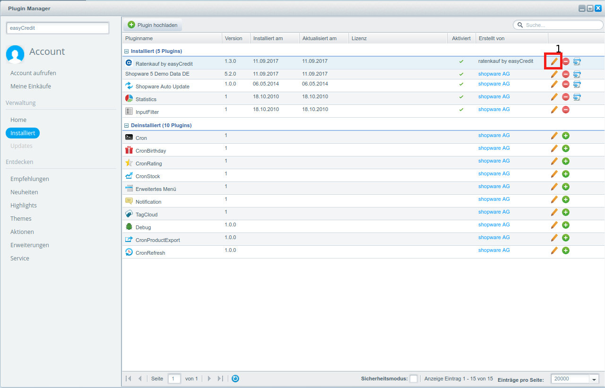
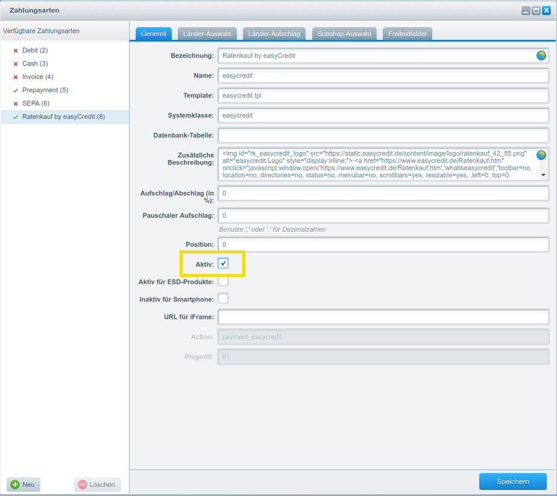
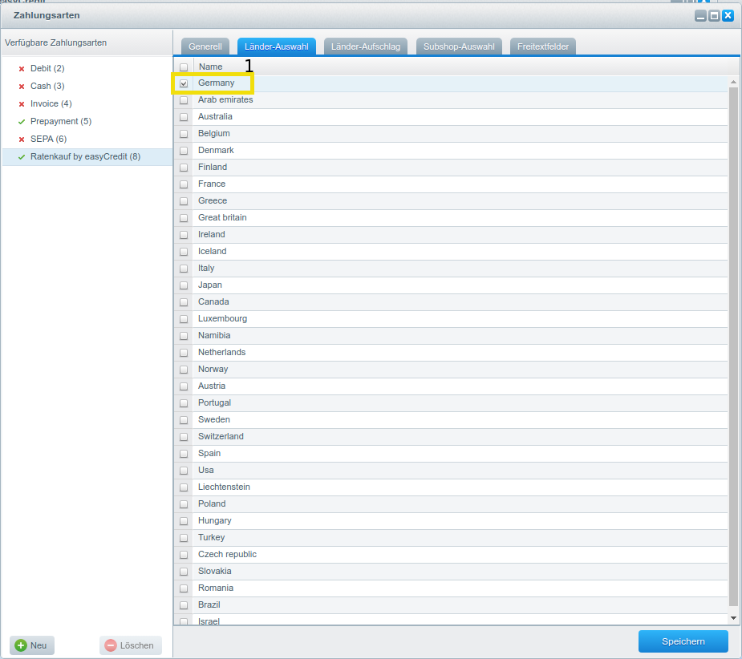

# Konfiguration

Zu erst muss das Plugin konfiguriert werden und danach noch als Zahlungsmethode für den deutschen Shop aktiviert werden.

## Konfigurations Menü öffnen

Zu erst müssen Sie sich im Backend Ihrer Shopware 5 Installation anmelden, der Link dafür ist normalerweise `http(s)://IHRE-SHOPWARE-URL.de/backend`.

Öffnen Sie im Backend nun den Plugin-Manager. Klicken Sie dazu entweder die drei Tasten `STRG + ALT + P` gleichzeitig oder öffnen Sie den Manager mit der Maus über folgende Menü-Punkte: `Einstellungen -> Plugin-Manager`.

In der Liste der installierten Plugins sollte nun **Ratenkauf by easyCredit** mit aufgelistet sein. In dieser Zeile klicken Sie das Stifte Icon (roter Kasten (1)) um die Plugin Konfiguration zu öffnen.

## Plugin Konfigurieren

| Option                                        | Erklärung                                                                                                                                                                                                                                                                       |
|-----------------------------------------------|---------------------------------------------------------------------------------------------------------------------------------------------------------------------------------------------------------------------------------------------------------------------------------|
| Zeige Modellrechner-Widget neben Produktpreis | Aktivieren Sie diese Option wenn Sie auf Produkt-Detail-Seiten ein monatliches Raten Angebot anzeigen möchten. Bitte beachten Sie das ein monatlicher Ratenpreis nur angezeigt wird wenn der Preis des Produkts sich in der festgelegten Preisspanne für Ratenkäufe befindet. | 
| Bestellungsstatus                     | Ermöglicht es Ihnen den Status festzulegen den Bestellungen die mit Ratenkauf by easyCredit bezahlt wurden, nach dem Eingang im System aufweisen.|
| Zahlungsstatus                     | Ermöglicht es Ihnen den Zahlungsstatus festzulegen den Bestallungen die mit Ratenkauf by easyCredit bezahlt wurden, nach dem Eingang im System aufweisen.|
| API Debug Logging                                 | Erlaubt Ihnen festzulegen ob der Inhalt aller easyCredit API-Zugriffe in var/log/debug.log gespeichert werden soll. Fehlermeldungen werden immer gespeichert.                                                                                                               |
| API Key                                       | Der API-Key wird Ihnen von der Teambank AG zur Verfügung gestellt.                                                                                                                                                                                                              |
| API Token                                     | Der nicht öffentliche API Token wird Ihnen von der Teambank AG zur Verfügung gestellt und sollte nicht mit Dritten geteilt werden.                                                                                                                                              |
| easyCredit Zugangsdaten überprüfen            | Ein Klick auf diesen Button überprüft die Kombination von API-Key und -Token auf Gültigkeit.                                                                                            |

**Bitte vergessen Sie nicht nach einem erfolgreichen Test noch auf Speichern zu klicken.**

## Zahlungsart Einstellungen

### Zahlungsart aktivieren

Im Shopware 5 Backend öffnen Sie den Zahlungsarten Eintrag für **Ratenkauf by easyCredit**

`System -> Konfiguration -> Zahlungsarten -> Ratenkauf by easyCredit`

Im ersten Reiter '*Generell*' muss sichergestellt werden das **Ratenkauf by easyCredit** aktiviert (gelbe Markierung (1)) ist:

### Länderauswahl

Im Reiter '*Länder-Auswahl*' muss noch Deutschland aktiviert (gelber Kasten (1)) werden:

